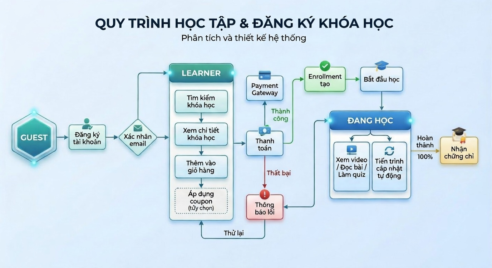
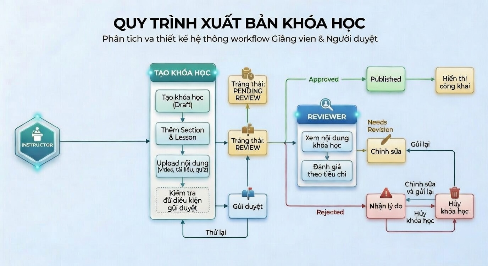
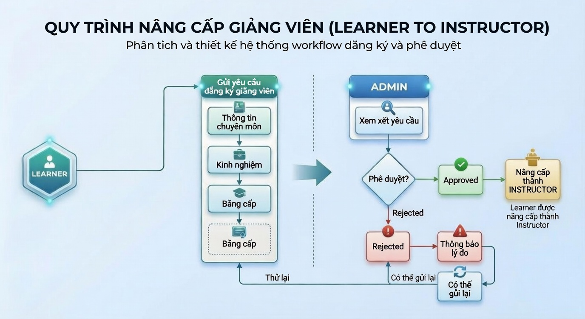
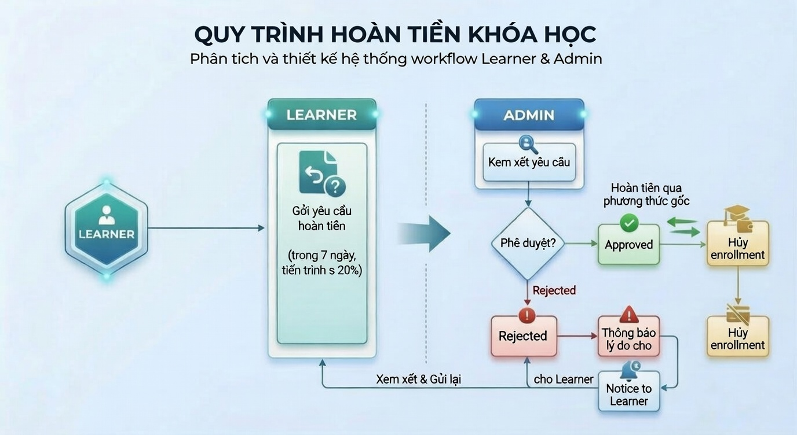

# User Requirements Specification (URS)

## Dự án: LearnOw - Nền tảng bán khóa học trực tuyến

| Thông tin         | Chi tiết   |
| ----------------- | ---------- |
| Phiên bản         | 1.0        |
| Ngày tạo          | 2026-03-05 |
| Cập nhật lần cuối | 2026-03-05 |
| Trạng thái        | Draft      |

---

## Mục lục

1. [Giới thiệu](#1-giới-thiệu)
2. [Phạm vi hệ thống](#2-phạm-vi-hệ-thống)
3. [Định nghĩa vai trò người dùng](#3-định-nghĩa-vai-trò-người-dùng)
4. [Yêu cầu chức năng](#4-yêu-cầu-chức-năng)
5. [Yêu cầu phi chức năng](#5-yêu-cầu-phi-chức-năng)
6. [Ma trận phân quyền](#6-ma-trận-phân-quyền)
7. [Luồng nghiệp vụ chính](#7-luồng-nghiệp-vụ-chính)
8. [Quy tắc nghiệp vụ](#8-quy-tắc-nghiệp-vụ)
9. [Phụ lục](#9-phụ-lục)

---

## 1. Giới thiệu

### 1.1 Mục đích

Tài liệu này mô tả đầy đủ các yêu cầu người dùng (User Requirements) cho hệ thống LearnOw — nền tảng bán khóa học trực tuyến. Tài liệu phục vụ làm cơ sở cho việc thiết kế, phát triển, kiểm thử và nghiệm thu hệ thống.

### 1.2 Đối tượng đọc

- Product Owner / Business Analyst
- Đội phát triển
- Stakeholders
- Đội vận hành hệ thống

### 1.3 Phạm vi tài liệu

Tài liệu bao gồm tất cả yêu cầu chức năng và phi chức năng cho phiên bản MVP (Minimum Viable Product) của hệ thống LearnOw.

### 1.4 Thuật ngữ & Viết tắt

| Thuật ngữ  | Định nghĩa                                                    |
| ---------- | ------------------------------------------------------------- |
| Learner    | Người học — người dùng đăng ký để mua và học khóa học         |
| Instructor | Giảng viên — người dùng tạo và bán khóa học                   |
| Reviewer   | Thẩm định viên — người xét duyệt khóa học trước khi công khai |
| Admin      | Quản trị viên hệ thống                                        |
| Course     | Khóa học bao gồm nhiều Section, mỗi Section chứa nhiều Lesson |
| Section    | Chương / Phần trong khóa học                                  |
| Lesson     | Bài học (video, bài viết, quiz) trong một Section             |
| Enrollment | Việc học viên đăng ký (mua) một khóa học                      |
| Review     | Đánh giá và nhận xét của học viên về khóa học                 |
| Payout     | Thanh toán tiền bán khóa học cho giảng viên                   |

---

## 2. Phạm vi hệ thống

### 2.1 Mô tả tổng quan

LearnOw là nền tảng thương mại điện tử chuyên về khóa học trực tuyến, cho phép:

- **Giảng viên** tạo, quản lý và bán khóa học
- **Học viên** tìm kiếm, mua và học khóa học
- **Thẩm định viên** đánh giá chất lượng khóa học trước khi công khai
- **Quản trị viên** quản lý toàn bộ hệ thống

### 2.2 Các module chính

| Module                   | Mô tả                                            |
| ------------------------ | ------------------------------------------------ |
| Authentication           | Đăng ký, đăng nhập, quản lý phiên, quên mật khẩu |
| User Management          | Quản lý hồ sơ, vai trò, trạng thái tài khoản     |
| Course Management        | CRUD khóa học, quản lý nội dung bài học          |
| Course Review & Approval | Quy trình thẩm định và duyệt khóa học            |
| Enrollment & Learning    | Mua khóa học, theo dõi tiến trình học            |
| Payment                  | Thanh toán, hoàn tiền, chia sẻ doanh thu         |
| Rating & Review          | Đánh giá và nhận xét khóa học                    |
| Notification             | Thông báo qua email và trong hệ thống            |
| Reporting & Analytics    | Báo cáo doanh thu, thống kê người dùng           |
| System Administration    | Quản trị người dùng, danh mục, cấu hình hệ thống, xử lý vi phạm |
| Content Delivery         | Phân phối video, tài liệu học tập                |

### 2.3 Ranh giới hệ thống (Out of Scope - MVP)

Các tính năng sau **không** nằm trong phạm vi MVP:

- Live streaming / Webinar
- Mobile app (chỉ hỗ trợ responsive web)
- AI-based recommendation (gợi ý khóa học bằng AI)
- Gamification nâng cao (huy hiệu, bảng xếp hạng)
- Multi-language (chỉ hỗ trợ tiếng Việt trong MVP)

---

## 3. Định nghĩa vai trò người dùng

### 3.1 Guest (Khách)

Người truy cập chưa đăng nhập.

- Xem trang chủ, danh sách khóa học công khai
- Xem chi tiết khóa học (mô tả, đánh giá, giá)
- Tìm kiếm và lọc khóa học
- Đăng ký tài khoản

### 3.2 Learner (Học viên)

Người dùng đã đăng ký với mục đích học tập.

- Tất cả quyền của Guest
- Mua khóa học
- Xem nội dung khóa học đã mua
- Đánh giá và nhận xét khóa học đã hoàn thành
- Quản lý hồ sơ cá nhân
- Xem lịch sử mua hàng
- Nhận chứng chỉ hoàn thành

### 3.3 Instructor (Giảng viên)

Người dùng đã đăng ký và được phê duyệt để tạo khóa học.

- Tất cả quyền của Learner
- Tạo và quản lý khóa học
- Upload nội dung (video, tài liệu, quiz)
- Gửi yêu cầu duyệt khóa học
- Xem báo cáo doanh thu khóa học của mình
- Quản lý coupon/mã giảm giá cho khóa học
- Trả lời câu hỏi / Q&A của học viên
- Yêu cầu rút tiền (payout)

### 3.4 Reviewer (Thẩm định viên)

Nhân sự nội bộ chịu trách nhiệm đánh giá chất lượng khóa học.

- Xem danh sách khóa học chờ duyệt
- Xem toàn bộ nội dung khóa học cần thẩm định
- Đánh giá khóa học theo tiêu chí định sẵn
- Phê duyệt / Từ chối / Yêu cầu chỉnh sửa khóa học
- Ghi nhận xét và lý do cho quyết định
- Xem lịch sử thẩm định của mình

### 3.5 Admin (Quản trị viên)

Quản trị viên hệ thống với toàn quyền.

- Quản lý người dùng (tạo, sửa, khóa, xóa, đổi vai trò)
- Quản lý danh mục khóa học (Category)
- Xem và quản lý tất cả khóa học
- Gỡ khóa học vi phạm
- Quản lý thẩm định viên
- Xem báo cáo tổng hợp (doanh thu, người dùng, khóa học)
- Cấu hình hệ thống (tỷ lệ chia doanh thu, chính sách hoàn tiền)
- Quản lý thông báo hệ thống
- Xử lý khiếu nại / Dispute

---

## 4. Yêu cầu chức năng

### 4.1 Authentication & Authorization

#### FR-AUTH-001: Đăng ký tài khoản

| Thuộc tính | Chi tiết                                                                                |
| ---------- | --------------------------------------------------------------------------------------- |
| Mô tả      | Người dùng có thể đăng ký tài khoản mới bằng email hoặc tài khoản mạng xã hội           |
| Actor      | Guest                                                                                   |
| Input      | Họ tên, Email, Mật khẩu, Xác nhận mật khẩu                                              |
| Validation | Email hợp lệ, chưa tồn tại. Mật khẩu tối thiểu 8 ký tự, bao gồm chữ hoa, chữ thường, số |
| Output     | Tài khoản được tạo với vai trò mặc định là Learner. Email xác nhận được gửi             |
| Ghi chú    | Hỗ trợ đăng ký qua Google OAuth 2.0                                                     |

#### FR-AUTH-002: Đăng nhập

| Thuộc tính | Chi tiết                                                            |
| ---------- | ------------------------------------------------------------------- |
| Mô tả      | Người dùng đăng nhập bằng email/mật khẩu hoặc tài khoản mạng xã hội |
| Actor      | Tất cả vai trò                                                      |
| Input      | Email, Mật khẩu                                                     |
| Output     | JWT Access Token + Refresh Token. Chuyển hướng theo vai trò         |
| Xử lý lỗi  | Sai mật khẩu 5 lần → khóa tài khoản 15 phút                         |

#### FR-AUTH-003: Quên mật khẩu

| Thuộc tính | Chi tiết                                               |
| ---------- | ------------------------------------------------------ |
| Mô tả      | Người dùng yêu cầu đặt lại mật khẩu qua email          |
| Actor      | Tất cả vai trò                                         |
| Input      | Email đã đăng ký                                       |
| Output     | Email chứa link đặt lại mật khẩu (hết hạn sau 30 phút) |

#### FR-AUTH-004: Đăng xuất

| Thuộc tính | Chi tiết                                        |
| ---------- | ----------------------------------------------- |
| Mô tả      | Người dùng đăng xuất khỏi hệ thống              |
| Actor      | Tất cả vai trò đã đăng nhập                     |
| Output     | Token bị vô hiệu hóa, chuyển về trang đăng nhập |

---

### 4.2 User Management

#### FR-USER-001: Quản lý hồ sơ cá nhân

| Thuộc tính | Chi tiết                                                      |
| ---------- | ------------------------------------------------------------- |
| Mô tả      | Người dùng cập nhật thông tin cá nhân                         |
| Actor      | Learner, Instructor, Reviewer, Admin                          |
| Input      | Họ tên, Avatar, Bio, Số điện thoại, Liên kết mạng xã hội      |
| Validation | Avatar ≤ 2MB, định dạng JPG/PNG. Số điện thoại đúng format VN |

#### FR-USER-002: Đăng ký làm Giảng viên

| Thuộc tính | Chi tiết                                                                           |
| ---------- | ---------------------------------------------------------------------------------- |
| Mô tả      | Learner gửi yêu cầu nâng cấp tài khoản thành Instructor                            |
| Actor      | Learner                                                                            |
| Input      | Lĩnh vực chuyên môn, Kinh nghiệm, Bằng cấp/Chứng chỉ (tùy chọn), Mẫu khóa học demo |
| Output     | Yêu cầu được gửi đến Admin để xét duyệt                                            |
| Trạng thái | Pending → Approved / Rejected                                                      |

#### FR-USER-003: Quản lý người dùng (Admin)

| Thuộc tính | Chi tiết                                                                             |
| ---------- | ------------------------------------------------------------------------------------ |
| Mô tả      | Admin quản lý danh sách người dùng hệ thống                                          |
| Actor      | Admin                                                                                |
| Chức năng  | Xem danh sách, Tìm kiếm, Lọc theo vai trò/trạng thái, Khóa/Mở tài khoản, Đổi vai trò |
| Ghi chú    | Không thể xóa cứng (hard delete), chỉ vô hiệu hóa (soft delete)                      |

---

### 4.3 Course Management

#### FR-COURSE-001: Tạo khóa học

| Thuộc tính          | Chi tiết                                                                                                                                  |
| ------------------- | ----------------------------------------------------------------------------------------------------------------------------------------- |
| Mô tả               | Giảng viên tạo khóa học mới                                                                                                               |
| Actor               | Instructor                                                                                                                                |
| Input bắt buộc      | Tên khóa học, Mô tả ngắn, Mô tả chi tiết, Danh mục, Ảnh thumbnail, Giá, Ngôn ngữ giảng dạy, Trình độ (Beginner / Intermediate / Advanced) |
| Input tùy chọn      | Video giới thiệu (preview), Yêu cầu tiên quyết, Mục tiêu học tập                                                                          |
| Trạng thái mặc định | Draft                                                                                                                                     |
| Validation          | Tên khóa học 10-100 ký tự. Mô tả ngắn ≤ 200 ký tự. Thumbnail ≤ 5MB                                                                        |

#### FR-COURSE-002: Quản lý nội dung khóa học

| Thuộc tính  | Chi tiết                                                                                  |
| ----------- | ----------------------------------------------------------------------------------------- |
| Mô tả       | Giảng viên thêm/sửa/xóa/sắp xếp Section và Lesson trong khóa học                          |
| Actor       | Instructor                                                                                |
| Cấu trúc    | Course → Section (1..n) → Lesson (1..n)                                                   |
| Loại Lesson | Video, Bài viết (Rich Text), Quiz, Tài liệu đính kèm                                      |
| Video       | Upload MP4, tối đa 2GB/video. Tự động transcode sang nhiều chất lượng (360p, 720p, 1080p) |
| Ghi chú     | Cho phép đánh dấu Lesson miễn phí (preview) để thu hút học viên                           |

#### FR-COURSE-003: Gửi yêu cầu duyệt khóa học

| Thuộc tính   | Chi tiết                                                                                      |
| ------------ | --------------------------------------------------------------------------------------------- |
| Mô tả        | Giảng viên gửi khóa học để thẩm định viên xem xét                                             |
| Actor        | Instructor                                                                                    |
| Điều kiện    | Khóa học phải có ít nhất 5 Lesson, tổng thời lượng video ≥ 30 phút, đầy đủ thông tin bắt buộc |
| Output       | Trạng thái khóa học chuyển từ Draft → Pending Review                                          |
| Notification | Thông báo đến Reviewer có khóa học mới cần duyệt                                              |

#### FR-COURSE-004: Cập nhật khóa học đã công khai

| Thuộc tính | Chi tiết                                                                                                              |
| ---------- | --------------------------------------------------------------------------------------------------------------------- |
| Mô tả      | Giảng viên cập nhật nội dung khóa học đang bán                                                                        |
| Actor      | Instructor                                                                                                            |
| Quy tắc    | Thay đổi nhỏ (sửa lỗi typo, thêm tài liệu): tự động cập nhật. Thay đổi lớn (thêm/xóa Section, đổi giá): cần duyệt lại |
| Ghi chú    | Học viên đã mua vẫn được truy cập nội dung cũ cho đến khi bản mới được duyệt                                          |

---

### 4.4 Course Review & Approval

#### FR-REVIEW-001: Xem danh sách khóa học chờ duyệt

| Thuộc tính | Chi tiết                                                 |
| ---------- | -------------------------------------------------------- |
| Mô tả      | Thẩm định viên xem danh sách khóa học đang chờ xét duyệt |
| Actor      | Reviewer                                                 |
| Hiển thị   | Tên khóa học, Giảng viên, Ngày gửi, Danh mục, Trạng thái |
| Sắp xếp    | Mặc định theo ngày gửi (cũ nhất trước - FIFO)            |
| Lọc        | Theo danh mục, ngày gửi, giảng viên                      |

#### FR-REVIEW-002: Thẩm định khóa học

| Thuộc tính        | Chi tiết                                                                               |
| ----------------- | -------------------------------------------------------------------------------------- |
| Mô tả             | Thẩm định viên đánh giá khóa học theo bộ tiêu chí                                      |
| Actor             | Reviewer                                                                               |
| Tiêu chí đánh giá | Xem bảng tiêu chí tại [Mục 8.2](#82-tiêu-chí-thẩm-định-khóa-học)                       |
| Quyết định        | **Approved** (Duyệt) / **Rejected** (Từ chối) / **Needs Revision** (Yêu cầu chỉnh sửa) |
| Input bắt buộc    | Điểm đánh giá cho từng tiêu chí, Nhận xét tổng thể                                     |
| Input khi từ chối | Lý do từ chối chi tiết, Gợi ý cải thiện                                                |

#### FR-REVIEW-003: Xử lý kết quả thẩm định

| Quyết định     | Hành động                                                                                               |
| -------------- | ------------------------------------------------------------------------------------------------------- |
| Approved       | Trạng thái → Published. Khóa học hiển thị công khai. Thông báo giảng viên                               |
| Rejected       | Trạng thái → Rejected. Thông báo giảng viên kèm lý do. Giảng viên có thể chỉnh sửa và gửi lại           |
| Needs Revision | Trạng thái → Needs Revision. Thông báo giảng viên kèm chi tiết cần sửa. Giảng viên chỉnh sửa và gửi lại |

#### FR-REVIEW-004: Lịch sử thẩm định

| Thuộc tính | Chi tiết                                                                    |
| ---------- | --------------------------------------------------------------------------- |
| Mô tả      | Lưu trữ toàn bộ lịch sử thẩm định cho mỗi khóa học                          |
| Dữ liệu    | Người thẩm định, Thời gian, Quyết định, Điểm từng tiêu chí, Nhận xét        |
| Truy cập   | Reviewer (lịch sử của mình), Admin (tất cả), Instructor (của khóa học mình) |

---

### 4.5 Enrollment & Learning (Đăng ký & Học tập)

#### FR-LEARN-001: Tìm kiếm & Duyệt khóa học

| Thuộc tính | Chi tiết                                                                     |
| ---------- | ---------------------------------------------------------------------------- |
| Mô tả      | Người dùng tìm kiếm và lọc khóa học                                          |
| Actor      | Guest, Learner, Instructor                                                   |
| Tìm kiếm   | Full-text search theo tên, mô tả, tên giảng viên                             |
| Bộ lọc     | Danh mục, Trình độ, Giá (miễn phí / có phí / khoảng giá), Đánh giá, Ngôn ngữ |
| Sắp xếp    | Phổ biến nhất, Mới nhất, Đánh giá cao nhất, Giá thấp → cao, Giá cao → thấp   |

#### FR-LEARN-002: Xem chi tiết khóa học

| Thuộc tính | Chi tiết                                                                                                                      |
| ---------- | ----------------------------------------------------------------------------------------------------------------------------- |
| Mô tả      | Hiển thị đầy đủ thông tin khóa học                                                                                            |
| Actor      | Tất cả                                                                                                                        |
| Hiển thị   | Tên, Mô tả, Mục tiêu, Yêu cầu tiên quyết, Danh sách Section/Lesson, Giảng viên, Đánh giá, Giá, Số học viên, Lần cập nhật cuối |
| Preview    | Cho phép xem các Lesson được đánh dấu miễn phí                                                                                |

#### FR-LEARN-003: Mua khóa học

| Thuộc tính | Chi tiết                                                                                            |
| ---------- | --------------------------------------------------------------------------------------------------- |
| Mô tả      | Học viên mua khóa học                                                                               |
| Actor      | Learner                                                                                             |
| Flow       | Thêm vào giỏ hàng → Áp dụng coupon (nếu có) → Chọn phương thức thanh toán → Thanh toán → Enrollment |
| Thanh toán | Hỗ trợ: Ví điện tử (MoMo, ZaloPay), Chuyển khoản ngân hàng, Thẻ quốc tế (Visa/Mastercard)           |
| Output     | Enrollment được tạo, Hóa đơn điện tử, Email xác nhận                                                |

#### FR-LEARN-004: Học khóa học

| Thuộc tính | Chi tiết                                                                          |
| ---------- | --------------------------------------------------------------------------------- |
| Mô tả      | Học viên xem nội dung và theo dõi tiến trình học                                  |
| Actor      | Learner (đã enrollment)                                                           |
| Chức năng  | Xem video (tốc độ 0.5x-2x), Đọc bài viết, Làm quiz, Tải tài liệu, Ghi chú cá nhân |
| Tiến trình | Tự động đánh dấu Lesson đã hoàn thành. Thanh tiến trình (%) cho toàn khóa học     |
| Ghi nhớ    | Ghi nhớ vị trí video đang xem để tiếp tục lần sau                                 |

#### FR-LEARN-005: Chứng chỉ hoàn thành

| Thuộc tính | Chi tiết                                                       |
| ---------- | -------------------------------------------------------------- |
| Mô tả      | Hệ thống cấp chứng chỉ khi học viên hoàn thành khóa học        |
| Điều kiện  | Hoàn thành 100% Lesson + Đạt điểm tối thiểu các Quiz (nếu có)  |
| Output     | Chứng chỉ PDF có mã xác thực duy nhất, có thể chia sẻ bằng URL |

---

### 4.6 Payment & Revenue (Thanh toán & Doanh thu)

#### FR-PAY-001: Thanh toán khóa học

| Thuộc tính | Chi tiết                                         |
| ---------- | ------------------------------------------------ |
| Mô tả      | Xử lý thanh toán khi học viên mua khóa học       |
| Tích hợp   | Payment Gateway (VNPay / MoMo / ZaloPay)         |
| Trạng thái | Pending → Success / Failed / Cancelled           |
| Timeout    | Đơn hàng hết hạn sau 30 phút nếu chưa thanh toán |

#### FR-PAY-002: Hoàn tiền

| Thuộc tính | Chi tiết                                                            |
| ---------- | ------------------------------------------------------------------- |
| Mô tả      | Học viên yêu cầu hoàn tiền                                          |
| Điều kiện  | Trong vòng 7 ngày kể từ ngày mua VÀ tiến trình học ≤ 20%            |
| Flow       | Learner gửi yêu cầu → Admin xem xét → Approved/Rejected → Hoàn tiền |
| Thời gian  | Hoàn tiền trong 5-10 ngày làm việc sau khi approved                 |

#### FR-PAY-003: Chia sẻ doanh thu & Payout

| Thuộc tính       | Chi tiết                                                  |
| ---------------- | --------------------------------------------------------- |
| Mô tả            | Chia doanh thu giữa hệ thống và giảng viên                |
| Tỷ lệ mặc định   | Platform 30% — Instructor 70% (có thể cấu hình bởi Admin) |
| Chu kỳ payout    | Hàng tháng, vào ngày 15 của tháng tiếp theo               |
| Điều kiện payout | Số dư tối thiểu 500.000 VNĐ                               |
| Phương thức      | Chuyển khoản ngân hàng                                    |

#### FR-PAY-004: Coupon & Giảm giá

| Thuộc tính | Chi tiết                                                                                                  |
| ---------- | --------------------------------------------------------------------------------------------------------- |
| Mô tả      | Quản lý mã giảm giá cho khóa học                                                                          |
| Actor      | Instructor (cho khóa học của mình), Admin (toàn hệ thống)                                                 |
| Loại       | Giảm theo % / Giảm số tiền cố định                                                                        |
| Tham số    | Mã coupon, Loại giảm, Giá trị, Ngày bắt đầu, Ngày kết thúc, Số lượt dùng tối đa, Áp dụng cho khóa học nào |

---

### 4.7 Rating & Review (Đánh giá khóa học)

#### FR-RATE-001: Đánh giá khóa học

| Thuộc tính | Chi tiết                                                             |
| ---------- | -------------------------------------------------------------------- |
| Mô tả      | Học viên đánh giá khóa học đã mua                                    |
| Actor      | Learner (đã enrollment, tiến trình ≥ 30%)                            |
| Input      | Số sao (1-5), Nhận xét (10-1000 ký tự)                               |
| Quy tắc    | Mỗi học viên chỉ đánh giá 1 lần / khóa học, có thể sửa               |
| Hiển thị   | Điểm trung bình, Phân bố số sao, Danh sách nhận xét (mới nhất trước) |

#### FR-RATE-002: Quản lý đánh giá

| Thuộc tính | Chi tiết                                            |
| ---------- | --------------------------------------------------- |
| Mô tả      | Quản lý và kiểm duyệt đánh giá                      |
| Actor      | Admin                                               |
| Chức năng  | Ẩn đánh giá vi phạm, Xem báo cáo đánh giá bị report |

---

### 4.8 Notification (Thông báo)

#### FR-NOTI-001: Hệ thống thông báo

| Sự kiện                        | Người nhận | Kênh           |
| ------------------------------ | ---------- | -------------- |
| Đăng ký tài khoản thành công   | User       | Email          |
| Mua khóa học thành công        | Learner    | Email + In-app |
| Khóa học có học viên mới       | Instructor | In-app         |
| Khóa học được gửi duyệt        | Reviewer   | Email + In-app |
| Kết quả thẩm định khóa học     | Instructor | Email + In-app |
| Yêu cầu hoàn tiền              | Admin      | Email + In-app |
| Kết quả hoàn tiền              | Learner    | Email + In-app |
| Payout đã xử lý                | Instructor | Email + In-app |
| Khóa học có đánh giá mới       | Instructor | In-app         |
| Yêu cầu đăng ký giảng viên mới | Admin      | In-app         |

#### FR-NOTI-002: Quản lý thông báo cá nhân

| Thuộc tính | Chi tiết                                                    |
| ---------- | ----------------------------------------------------------- |
| Mô tả      | Người dùng quản lý thông báo của mình                       |
| Chức năng  | Xem danh sách, Đánh dấu đã đọc, Xóa, Cài đặt nhận thông báo |

---

### 4.9 Reporting & Analytics (Báo cáo)

#### FR-REPORT-001: Dashboard Giảng viên

| Thuộc tính | Chi tiết                                                                                                |
| ---------- | ------------------------------------------------------------------------------------------------------- |
| Mô tả      | Giảng viên xem thống kê khóa học của mình                                                               |
| Dữ liệu    | Tổng doanh thu, Số học viên, Điểm đánh giá trung bình, Tỷ lệ hoàn thành, Doanh thu theo tháng (biểu đồ) |

#### FR-REPORT-002: Dashboard Admin

| Thuộc tính | Chi tiết                                                                                                                                    |
| ---------- | ------------------------------------------------------------------------------------------------------------------------------------------- |
| Mô tả      | Admin xem thống kê tổng hợp toàn hệ thống                                                                                                   |
| Dữ liệu    | Tổng người dùng (theo vai trò), Tổng khóa học (theo trạng thái), Doanh thu tổng (theo tháng/quý/năm), Top khóa học bán chạy, Top giảng viên |

---

### 4.10 System Administration (Quản trị hệ thống)

#### FR-ADMIN-001: Quản lý người dùng

| Thuộc tính | Chi tiết                                                                                                            |
| ---------- | ------------------------------------------------------------------------------------------------------------------- |
| Mô tả      | Admin quản lý toàn bộ người dùng trong hệ thống                                                                     |
| Actor      | Admin                                                                                                               |
| Chức năng  | Xem danh sách người dùng, Tìm kiếm, Lọc theo vai trò/trạng thái, Khóa/Mở khóa tài khoản, Thay đổi vai trò          |
| Quy tắc    | Không hỗ trợ xóa cứng (hard delete), chỉ vô hiệu hóa (soft delete). Admin không thể khóa chính tài khoản của mình  |
| Xem thêm   | Liên quan FR-USER-003                                                                                                |

#### FR-ADMIN-002: Duyệt yêu cầu đăng ký giảng viên

| Thuộc tính | Chi tiết                                                                                                         |
| ---------- | ---------------------------------------------------------------------------------------------------------------- |
| Mô tả      | Admin xem xét và phê duyệt yêu cầu nâng cấp tài khoản Learner thành Instructor                                   |
| Actor      | Admin                                                                                                            |
| Hiển thị   | Danh sách yêu cầu chờ duyệt: Họ tên, Email, Lĩnh vực chuyên môn, Kinh nghiệm, Bằng cấp, Ngày gửi                |
| Quyết định | **Approved**: Tài khoản được nâng cấp thành Instructor. **Rejected**: Giữ nguyên Learner, gửi lý do từ chối       |
| Thông báo  | Gửi email + in-app thông báo kết quả cho Learner                                                                  |
| Xem thêm   | Liên quan FR-USER-002                                                                                             |

#### FR-ADMIN-003: Quản lý danh mục khóa học

| Thuộc tính | Chi tiết                                                                                     |
| ---------- | -------------------------------------------------------------------------------------------- |
| Mô tả      | Admin quản lý cây danh mục (Category) của khóa học                                             |
| Actor      | Admin                                                                                        |
| Chức năng  | Thêm / Sửa / Xóa / Sắp xếp danh mục và danh mục con (sub-category)                           |
| Input      | Tên danh mục, Slug, Mô tả, Icon/Ảnh, Danh mục cha (nếu là sub-category), Thứ tự hiển thị     |
| Validation | Tên danh mục duy nhất trong cùng cấp. Slug tự sinh từ tên, không trùng lặp                    |
| Quy tắc    | Không thể xóa danh mục đang có khóa học. Phải di chuyển khóa học sang danh mục khác trước     |

#### FR-ADMIN-004: Gỡ khóa học vi phạm

| Thuộc tính | Chi tiết                                                                                              |
| ---------- | ----------------------------------------------------------------------------------------------------- |
| Mô tả      | Admin gỡ (suspend) khóa học vi phạm chính sách hoặc bị báo cáo                                         |
| Actor      | Admin                                                                                                 |
| Chức năng  | Xem danh sách khóa học bị báo cáo, Xem nội dung khóa học, Gỡ khóa học, Khôi phục khóa học đã gỡ       |
| Input      | Lý do gỡ (bắt buộc)                                                                                   |
| Hậu quả    | Trạng thái khóa học → Suspended. Khóa học không hiển thị công khai. Học viên đã mua vẫn truy cập được  |
| Thông báo  | Gửi email + in-app thông báo cho Instructor kèm lý do                                                  |

#### FR-ADMIN-005: Xử lý yêu cầu hoàn tiền

| Thuộc tính | Chi tiết                                                                                                 |
| ---------- | -------------------------------------------------------------------------------------------------------- |
| Mô tả      | Admin xem xét và xử lý yêu cầu hoàn tiền từ học viên                                                      |
| Actor      | Admin                                                                                                    |
| Hiển thị   | Danh sách yêu cầu hoàn tiền: Mã đơn, Học viên, Khóa học, Số tiền, Lý do, Ngày yêu cầu, Tiến trình học   |
| Quyết định | **Approved**: Tiến hành hoàn tiền qua Payment Gateway. **Rejected**: Gửi lý do từ chối cho học viên       |
| Quy tắc    | Chỉ xử lý yêu cầu trong vòng 7 ngày kể từ ngày mua VÀ tiến trình học ≤ 20%                              |
| Thời gian  | Hoàn tiền trong 5-10 ngày làm việc sau khi approved                                                       |
| Xem thêm   | Liên quan FR-PAY-002                                                                                      |

#### FR-ADMIN-006: Xử lý payout cho giảng viên

| Thuộc tính | Chi tiết                                                                                                   |
| ---------- | ---------------------------------------------------------------------------------------------------------- |
| Mô tả      | Admin xử lý yêu cầu rút tiền (payout) của giảng viên                                                        |
| Actor      | Admin                                                                                                      |
| Hiển thị   | Danh sách yêu cầu payout: Giảng viên, Số tiền, Thông tin ngân hàng, Ngày yêu cầu, Trạng thái               |
| Chức năng  | Duyệt payout, Từ chối payout (kèm lý do), Xác nhận đã chuyển khoản                                          |
| Trạng thái | Pending → Processing → Completed / Failed                                                                    |
| Quy tắc    | Chỉ xử lý payout cho doanh thu đã confirmed (qua thời hạn hoàn tiền 7 ngày). Số dư tối thiểu 500.000 VNĐ   |
| Xem thêm   | Liên quan FR-PAY-003                                                                                        |

#### FR-ADMIN-007: Quản lý đánh giá vi phạm

| Thuộc tính | Chi tiết                                                                                                |
| ---------- | ------------------------------------------------------------------------------------------------------- |
| Mô tả      | Admin quản lý các đánh giá bị báo cáo vi phạm (spam, xúc phạm, không liên quan)                          |
| Actor      | Admin                                                                                                   |
| Hiển thị   | Danh sách đánh giá bị báo cáo: Người đánh giá, Khóa học, Nội dung, Lý do báo cáo, Số lượt báo cáo       |
| Quyết định | **Xóa đánh giá**: Ẩn đánh giá vi phạm, cập nhật điểm trung bình. **Giữ lại**: Đánh dấu đã xem xét       |
| Thông báo  | Gửi thông báo cho người đánh giá khi đánh giá bị xóa                                                      |
| Xem thêm   | Liên quan FR-RATE-002                                                                                    |

#### FR-ADMIN-008: Cấu hình hệ thống

| Thuộc tính | Chi tiết                                                                                        |
| ---------- | ----------------------------------------------------------------------------------------------- |
| Mô tả      | Admin cấu hình các tham số hoạt động của hệ thống                                                |
| Actor      | Admin                                                                                           |
| Tham số    | Tỷ lệ chia doanh thu (Platform/Instructor), Thời hạn hoàn tiền, Số tiền payout tối thiểu,       |
|            | Số lần đăng nhập sai tối đa, Thời gian khóa tài khoản, Kích thước file upload tối đa             |
| Quy tắc    | Thay đổi cấu hình ghi log đầy đủ (ai thay đổi, thời gian, giá trị cũ → mới)                      |
| Ghi chú    | Một số tham số yêu cầu restart service để có hiệu lực (thông báo rõ cho Admin)                    |

#### FR-ADMIN-009: Dashboard Admin

| Thuộc tính | Chi tiết                                                                                                                                     |
| ---------- | -------------------------------------------------------------------------------------------------------------------------------------------- |
| Mô tả      | Admin xem tổng quan hoạt động hệ thống trên một giao diện tập trung                                                                          |
| Actor      | Admin                                                                                                                                        |
| Dữ liệu    | Tổng người dùng (theo vai trò), Tổng khóa học (theo trạng thái), Doanh thu tổng (theo tháng/quý/năm), Top khóa học bán chạy, Top giảng viên  |
| Widget     | Số yêu cầu hoàn tiền chờ xử lý, Số yêu cầu đăng ký giảng viên chờ duyệt, Số đánh giá bị báo cáo, Số payout chờ xử lý                        |
| Xem thêm   | Liên quan FR-REPORT-002                                                                                                                      |

#### FR-ADMIN-010: Báo cáo doanh thu

| Thuộc tính | Chi tiết                                                                                                |
| ---------- | ------------------------------------------------------------------------------------------------------- |
| Mô tả      | Admin xem báo cáo doanh thu chi tiết của toàn hệ thống                                                    |
| Actor      | Admin                                                                                                   |
| Bộ lọc     | Theo khoảng thời gian (ngày/tuần/tháng/quý/năm), Theo danh mục, Theo giảng viên                          |
| Dữ liệu    | Tổng doanh thu, Số đơn hàng, Tổng hoàn tiền, Doanh thu ròng, Top khóa học bán chạy, Biểu đồ xu hướng    |
| Xuất báo cáo | Hỗ trợ xuất báo cáo dạng CSV / Excel                                                                   |

---

## 5. Yêu cầu phi chức năng

### 5.1 Hiệu năng (Performance)

| ID          | Yêu cầu                                                          |
| ----------- | ---------------------------------------------------------------- |
| NFR-PERF-01 | Thời gian phản hồi trang ≤ 2 giây (trung bình)                   |
| NFR-PERF-02 | Thời gian tải video (buffer ban đầu) ≤ 3 giây với kết nối 10Mbps |
| NFR-PERF-03 | Hệ thống phục vụ tối thiểu 1000 người dùng đồng thời             |
| NFR-PERF-04 | API response time ≤ 500ms cho 95% requests                       |

### 5.2 Bảo mật (Security)

| ID         | Yêu cầu                                                           |
| ---------- | ----------------------------------------------------------------- |
| NFR-SEC-01 | Mã hóa mật khẩu bằng bcrypt (cost factor ≥ 12)                    |
| NFR-SEC-02 | Tất cả API yêu cầu authentication (trừ public endpoints)          |
| NFR-SEC-03 | HTTPS bắt buộc cho toàn bộ hệ thống                               |
| NFR-SEC-04 | JWT Access Token hết hạn sau 15 phút, Refresh Token sau 7 ngày    |
| NFR-SEC-05 | Bảo vệ video khỏi download trái phép (signed URL, DRM cơ bản)     |
| NFR-SEC-06 | Input validation và sanitization cho tất cả user input            |
| NFR-SEC-07 | Rate limiting: 100 requests/phút/IP cho API, 5 lần/phút cho login |
| NFR-SEC-08 | CORS policy chỉ cho phép origin hợp lệ                            |

### 5.3 Khả năng mở rộng (Scalability)

| ID         | Yêu cầu                                           |
| ---------- | ------------------------------------------------- |
| NFR-SCA-01 | Kiến trúc cho phép horizontal scaling             |
| NFR-SCA-02 | Lưu trữ video trên Cloud Storage (S3/GCS) với CDN |
| NFR-SCA-03 | Database hỗ trợ read replica                      |

### 5.4 Tính sẵn sàng (Availability)

| ID         | Yêu cầu                                                   |
| ---------- | --------------------------------------------------------- |
| NFR-AVA-01 | Uptime ≥ 99.5% (không tính thời gian bảo trì theo lịch)   |
| NFR-AVA-02 | Thời gian bảo trì tối đa 4 giờ/tháng, thông báo trước 24h |

### 5.5 Khả năng sử dụng (Usability)

| ID         | Yêu cầu                                                                  |
| ---------- | ------------------------------------------------------------------------ |
| NFR-USA-01 | Responsive design hỗ trợ Desktop, Tablet, Mobile                         |
| NFR-USA-02 | Hỗ trợ trình duyệt: Chrome, Firefox, Safari, Edge (2 phiên bản mới nhất) |
| NFR-USA-03 | Thời gian học cách sử dụng hệ thống ≤ 10 phút cho người dùng phổ thông   |
| NFR-USA-04 | Tuân thủ WCAG 2.1 Level AA cho accessibility                             |

### 5.6 Sao lưu & Phục hồi (Backup & Recovery)

| ID         | Yêu cầu                                             |
| ---------- | --------------------------------------------------- |
| NFR-BAK-01 | Sao lưu database tự động hàng ngày, giữ lại 30 ngày |
| NFR-BAK-02 | RPO (Recovery Point Objective) ≤ 1 giờ              |
| NFR-BAK-03 | RTO (Recovery Time Objective) ≤ 4 giờ               |

---

## 6. Ma trận phân quyền

### 6.1 Bảng phân quyền chính

| Chức năng                      | Guest | Learner | Instructor | Reviewer | Admin |
| ------------------------------ | :---: | :-----: | :--------: | :------: | :---: |
| Xem trang chủ                  |  ✅   |   ✅    |     ✅     |    ✅    |  ✅   |
| Tìm kiếm khóa học              |  ✅   |   ✅    |     ✅     |    ✅    |  ✅   |
| Xem chi tiết khóa học          |  ✅   |   ✅    |     ✅     |    ✅    |  ✅   |
| Đăng ký tài khoản              |  ✅   |   ❌    |     ❌     |    ❌    |  ❌   |
| Quản lý hồ sơ cá nhân          |  ❌   |   ✅    |     ✅     |    ✅    |  ✅   |
| Mua khóa học                   |  ❌   |   ✅    |     ✅     |    ❌    |  ❌   |
| Học khóa học đã mua            |  ❌   |   ✅    |     ✅     |    ❌    |  ❌   |
| Đánh giá khóa học              |  ❌   |   ✅    |     ✅     |    ❌    |  ❌   |
| Đăng ký làm giảng viên         |  ❌   |   ✅    |     ❌     |    ❌    |  ❌   |
| Tạo / Quản lý khóa học         |  ❌   |   ❌    |     ✅     |    ❌    |  ❌   |
| Gửi khóa học đi duyệt          |  ❌   |   ❌    |     ✅     |    ❌    |  ❌   |
| Xem dashboard giảng viên       |  ❌   |   ❌    |     ✅     |    ❌    |  ❌   |
| Quản lý coupon (khóa học mình) |  ❌   |   ❌    |     ✅     |    ❌    |  ❌   |
| Yêu cầu payout                 |  ❌   |   ❌    |     ✅     |    ❌    |  ❌   |
| Xem khóa học chờ duyệt         |  ❌   |   ❌    |     ❌     |    ✅    |  ✅   |
| Thẩm định khóa học             |  ❌   |   ❌    |     ❌     |    ✅    |  ❌   |
| Xem lịch sử thẩm định          |  ❌   |   ❌    |     ❌     |    ✅    |  ✅   |
| Quản lý người dùng             |  ❌   |   ❌    |     ❌     |    ❌    |  ✅   |
| Quản lý danh mục               |  ❌   |   ❌    |     ❌     |    ❌    |  ✅   |
| Gỡ khóa học vi phạm            |  ❌   |   ❌    |     ❌     |    ❌    |  ✅   |
| Xử lý hoàn tiền                |  ❌   |   ❌    |     ❌     |    ❌    |  ✅   |
| Xem dashboard admin            |  ❌   |   ❌    |     ❌     |    ❌    |  ✅   |
| Cấu hình hệ thống              |  ❌   |   ❌    |     ❌     |    ❌    |  ✅   |
| Quản lý coupon toàn hệ thống   |  ❌   |   ❌    |     ❌     |    ❌    |  ✅   |

---

## 7. Luồng nghiệp vụ chính



### 7.2 Luồng tạo & Duyệt khóa học



### 7.3 Luồng đăng ký giảng viên



### 7.4 Luồng hoàn tiền



## 8. Quy tắc nghiệp vụ

### 8.1 Quy tắc chung

| ID     | Quy tắc                                                                                  |
| ------ | ---------------------------------------------------------------------------------------- |
| BR-001 | Một tài khoản có thể mang nhiều vai trò đồng thời (ví dụ: vừa Learner vừa Instructor)    |
| BR-002 | Learner không thể mua khóa học của chính mình (nếu đồng thời là Instructor)              |
| BR-003 | Giảng viên chỉ có thể quản lý khóa học do mình tạo                                       |
| BR-004 | Khóa học phải ở trạng thái Published mới hiển thị cho người dùng công khai               |
| BR-005 | Xóa tài khoản giảng viên → khóa học chuyển sang Suspended, học viên cũ vẫn truy cập được |
| BR-006 | Giá khóa học tối thiểu 0 VNĐ (miễn phí), tối đa 10.000.000 VNĐ                           |
| BR-007 | Một khóa học chỉ thuộc một danh mục chính, có thể có sub-category                        |
| BR-008 | Thẩm định viên không thể duyệt khóa học mà mình tạo (nếu có vai trò Instructor)          |

### 8.2 Tiêu chí thẩm định khóa học

Reviewer đánh giá khóa học theo các tiêu chí sau (thang điểm 1-5 cho mỗi tiêu chí):

| #   | Tiêu chí                  | Mô tả                                            | Trọng số | Điểm tối thiểu |
| --- | ------------------------- | ------------------------------------------------ | -------- | -------------- |
| 1   | Chất lượng nội dung       | Nội dung chính xác, cập nhật, đúng chủ đề        | 30%      | 3              |
| 2   | Cấu trúc khóa học         | Logic sắp xếp, tiến trình từ cơ bản đến nâng cao | 20%      | 3              |
| 3   | Chất lượng video/âm thanh | Hình ảnh rõ nét, âm thanh rõ ràng, không nhiễu   | 20%      | 3              |
| 4   | Tài liệu bổ trợ           | Có tài liệu, bài tập, quiz phù hợp               | 15%      | 2              |
| 5   | Mô tả & Metadata          | Tên, mô tả, thumbnail chuyên nghiệp và chính xác | 15%      | 3              |

**Quy tắc duyệt:**

- Khóa học được **Approved** khi: Tất cả tiêu chí đạt điểm tối thiểu VÀ điểm trung bình có trọng số ≥ 3.5
- Khóa học bị **Rejected** khi: Bất kỳ tiêu chí nào có điểm 1 HOẶC điểm trung bình có trọng số < 2.5
- Các trường hợp còn lại: **Needs Revision**

### 8.3 Quy tắc tài chính

| ID        | Quy tắc                                                                      |
| --------- | ---------------------------------------------------------------------------- |
| BR-FIN-01 | Doanh thu được ghi nhận sau khi hết thời hạn hoàn tiền (7 ngày)              |
| BR-FIN-02 | Khi có hoàn tiền, phần chia sẻ doanh thu của Instructor bị trừ tương ứng     |
| BR-FIN-03 | Payout chỉ xử lý cho doanh thu đã "confirmed" (qua thời hạn hoàn tiền)       |
| BR-FIN-04 | Instructor phải cung cấp thông tin ngân hàng hợp lệ trước khi yêu cầu payout |

---

## 9. Phụ lục

### 9.1 Trạng thái các entity chính

#### Trạng thái Khóa học (Course Status)

| Trạng thái     | Mô tả                            |
| -------------- | -------------------------------- |
| Draft          | Đang soạn, chưa gửi duyệt        |
| Pending Review | Đã gửi, đang chờ thẩm định       |
| Needs Revision | Thẩm định viên yêu cầu chỉnh sửa |
| Rejected       | Bị từ chối                       |
| Published      | Đã duyệt, hiển thị công khai     |
| Suspended      | Bị gỡ bởi Admin                  |

#### Trạng thái Đơn hàng (Order Status)

| Trạng thái | Mô tả                 |
| ---------- | --------------------- |
| Pending    | Chờ thanh toán        |
| Completed  | Thanh toán thành công |
| Failed     | Thanh toán thất bại   |
| Cancelled  | Đã hủy                |
| Refunded   | Đã hoàn tiền          |

#### Trạng thái Payout

| Trạng thái | Mô tả                 |
| ---------- | --------------------- |
| Pending    | Chờ xử lý             |
| Processing | Đang chuyển khoản     |
| Completed  | Đã thanh toán         |
| Failed     | Chuyển khoản thất bại |

### 9.3 Lịch sử thay đổi tài liệu

| Phiên bản | Ngày       | Người thay đổi | Mô tả                |
| --------- | ---------- | -------------- | -------------------- |
| 1.0       | 2026-03-05 | —              | Tạo tài liệu ban đầu |

```

```
